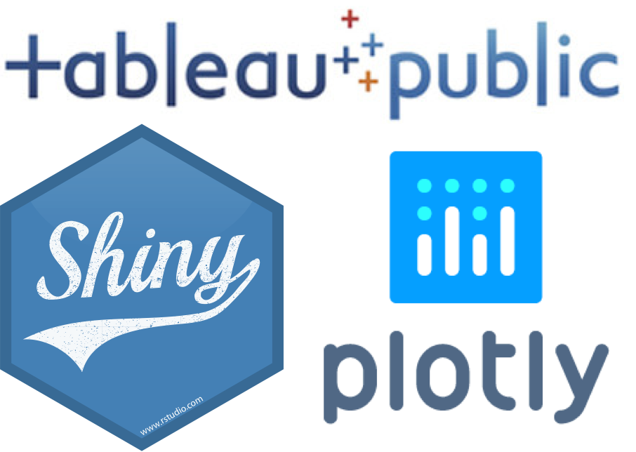

---
output:
  html_document:
    toc_float: false
---


<!-- ```{js} -->
<!-- $("#rStudioHeader").removeClass("alwaysShrunk"); -->
<!-- $("#pageContent").removeClass("standardPadding"); -->
<!-- ``` -->


<!--html_preserve-->

<div class="row align-items-center">

<div class="col-md-5 align-self-center">
<center>

<center>
</div>

<div class="col-md-7 align-self-center">
        <span style="font-size:35px">Interactive Data Network: Charts</span>
        <br>
        <span>This website provides support to researchers in choosing and developing interactive data visualisations for increased outreach and impact. For more information about the IDN please consult the service website at <a href="http://idn.it.ox.ac.uk" title="http://idn.it.ox.ac.uk" target="_blank">idn.it.ox.ac.uk</a></span>
        <br>
        <span>In this site you'll find an overview of the visualisation <b>tools</b>, <b>types of chart</b> and <b>types of interactivity</b> that the IDN is able to support you in using.</span>
        <br>
        <span>Most example visualisations in this site (including those below) are built using a combination of <b>R</b> and <b>Shiny</b>, which you can read about <a href="tools.html#tools-R">here</a>.</span>

<div class="row">
   <div class=".col-xs-6">

```{r basic_barchart, echo=FALSE, message=FALSE, warning=FALSE}
library("highcharter")
library("tidyverse")
my_data <- tribble(
  ~category, ~subcategory, ~value,
  "Mammal", "human", 3,
  "Mammal", "non-human", 4,
  "Reptile", "snake", 6,
  "Reptile", "iguana", 8
)
my_data %>%
  hchart(
    type = "bar",
    hcaes(
      x = category,
      y = value
    )
  ) %>%
  hc_size(width = "200px", height = "200px") %>%
  hc_title(text = "Normal barchart",
           style = list(fontSize = 12))
```

</div>

<div class=".col-xs-6">

```{r stacked_barchart, echo=FALSE, message=FALSE, warning=FALSE}
library("highcharter")
library("tidyverse")
my_data <- tribble(
  ~category, ~subcategory, ~value,
  "Mammal", "human", 3,
  "Mammal", "non-human", 4,
  "Reptile", "snake", 6,
  "Reptile", "iguana", 8
)
my_data %>%
  hchart(
    type = "bar",
    hcaes(
      x = category,
      y = value,
      group = subcategory
    )
  ) %>%
  hc_size(width = "200px", height = "200px") %>%
  hc_plotOptions(series = list(stacking = "percent")) %>%
  hc_title(text = "Stacked percentage barchart",
           style = list(fontSize = 12))
```

</div>
</div>
        
        </div>
</div>


<br>
<br>

<!---- Tools ----->

<div class="row align-items-center">

<div class="col-md-5 align-self-center">
<center>

<center>
</div>

<div class="col-md-7 align-self-center">
        <span style="font-size:35px">What Tools?</span>
        <br>
        <span>There are hundreds of visualisation tools and packages used by researchers at University of Oxford and beyond, the IDN cannot hope to be a reference or a recommendation engine for all of these solutions. For a birds eye view of what tools are available see <a href="http://www.visualisingdata.com/resources/" title="http://www.visualisingdata.com/resources/" target="_blank">http://www.visualisingdata.com/resources/</a>.</span>
        <br>
        <br>
        <span>We specifically advise on tools which allow researchers to achieve the following:</span>
        <ul>
        <li>Embed interactive visualisations in personal/research group/publication websites</li>
        <li>Allow viewers to directly access the data powering the visualisation</li>
        </ul>
        <span>
        Our <a href="tools.html">Tools</a> page provides advice on how to choose a tool and our tools of choice, which are; <b>Plotly</b>, <b>Shiny</b>, or <b>Tableau Public</b>.
        </span>
        </div>
</div>

<!--/html_preserve-->


